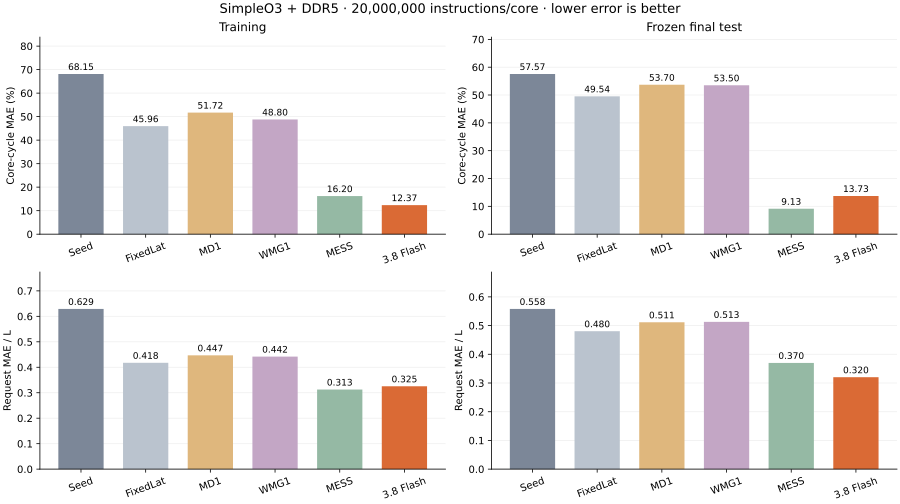

# Extended Gemini search attempts — 2026-09-05

Both independent runs were configured for 25 evaluated designs and USD 100
per model. Provider connection failures stopped Pro after six evaluated designs
and Flash after four. Their incumbents were frozen, tested, and archived, and
both integrity audits passed. These are interrupted search prefixes, not a
completed 25-design comparison. No output-token or spending cap caused either
stop, and no optimization is continuing from these test-exposed selections.

## Setup and measurement

The execution protocol was frozen at commit `a10c072` (individual-run v6).
Each model started independently from the same fixed-delay Atomic seed with
HIGH thinking, a 65,536-token output ceiling, and six CPU slots. Evaluation
used explicit `-O3`, with at most 12 evaluation CPUs across the two runs.
Each proposed design could use 48 model turns, 192 diagnostic requests, 12
repair drafts, and 60 generation attempts. These are safety limits, not
accuracy thresholds. The agents saw only their own training feedback and
allowlisted public sources, not the prior feasibility design or other runs.

All workloads used closed-loop SimpleO3 and DDR5_16Gb_x8 / DDR5_4800AN,
one core/channel/rank, open rows, no refresh, 64-entry read/write buffers,
and write-drain low/high watermarks of 0.5/0.8. GenericDDR FRFCFS-RowHit was
the oracle. Each workload issued 20 million instructions from a cold start,
without wrapping, and drained completely. There was no unscored warmup.
Training used mcf and lbm; final testing used milc, soplex, GemsFDTD, and
fotonik3d only after that run's selection froze. These families were already
known to the meta-reviewers; this is not a pristine unseen benchmark for
adaptive experiments. Transfer studies remain deferred.

Core-cycle MAE is the absolute percentage cycle error relative to the oracle,
averaged over cores within a workload and then equally over workloads.
For logical read i, `d_i = model_latency_i - oracle_latency_i`, in frontend
cycles. Reads must pair exactly in both directions by stable identity and
agree in address/type. For each workload, `L` is the mean latency of **all
oracle logical reads**, including LLC hits, merged misses, and DRAM miss
owners. Request MAE/L is `mean(abs(d_i))/L`, averaged equally over workloads.
Positive d means overprediction. Neither metric substitutes for the other.

Promotion requires no worsening in either primary metric and a strict
improvement in at least one. Non-dominated tradeoffs can remain in the parent
archive without replacing the incumbent. Only the proposing Gemini backend
edits candidate logic. The orchestrating coding agent reviews atomicity,
boundedness, and compliance, without supplying modeling implementations or
tuning values; this is externally supervised compliance, not an unreviewed
single-model loop. No human modeling hints were supplied.

## Headline results

The [comparison index](results/gemini_extended_20260905/summary.json) references
separate [Pro](results/gemini31pro_25i_20260905/summary.json) and
[Flash](results/gemini38flash_25i_20260905/summary.json) records. It does not
merge budgets, interactions, lineages, or selections.

| Model | Training core MAE (%) | Training request MAE/L | Test core MAE (%) | Test request MAE/L |
| --- | ---: | ---: | ---: | ---: |
| Fixed-delay seed | 68.15 | 0.6291 | 57.57 | 0.5580 |
| FixedLat | 45.96 | 0.4176 | 49.54 | 0.4804 |
| zsim-style M/D/1 | 51.72 | 0.4468 | 53.70 | 0.5115 |
| Sniper channel WMG1 | 48.80 | 0.4420 | 53.50 | 0.5130 |
| MESS | 16.20 | 0.3126 | 9.13 | 0.3700 |
| Gemini 3.1 Pro (`pro_001`) | 34.54 | 0.4560 | 36.06 | 0.4177 |
| Gemini 3.8 Flash (`flash_004`) | 12.37 | 0.3253 | 13.73 | 0.3201 |

Flash has lower test error on both objectives than Pro and the seed, FixedLat,
M/D/1, and WMG1 comparators. Relative to MESS, Flash trades higher core-cycle
error for lower request error. MESS uses the harness's oracle-calibrated DDR5
bandwidth/latency surface; its calibration advantage should remain explicit.
The under-review bank-level queueing model is not part of this work.

Pro's first design remained selected. Later candidates reached lower core
error but worsened request error; for example, the sixth achieved
22.06% / 0.4768 and was not promoted. Thus its one completed design beyond
the five-design checkpoint did not improve the incumbent. Flash improved
both objectives at its fourth design but did not reach a fifth evaluation.
There are no measured checkpoints at 10, 15, 20, or 25 for either run.

The earlier separate five-design trials selected different sources and had
different tradeoffs: Pro tested at 15.37% / 0.4945 and Flash at
10.85% / 0.3889. The current runs began fresh and were told a different search
horizon. Stochastic initial proposals and unequal completed search lengths
prevent attributing these differences to iteration count. Useful generated
models remain evidence of feasibility; these results do not establish a
general ranking of LLM capability.

## Selected designs and remaining errors

The [Pro source](results/gemini31pro_25i_20260905/selected.cpp) uses per-bank
open-row/readiness state, a scalar shared-bus availability time, and a virtual
write counter that triggers aggregate bus blocking at configured watermarks.
Declared weights scale row-miss delay and bank occupancy to approximate
reordering; writes otherwise depart after a fixed delay. Prediction is O(1)
with O(B) model state for B configured banks. These weights do not guarantee
physical command-timing fidelity or exact FRFCFS behavior.

The [Flash source](results/gemini38flash_25i_20260905/selected.cpp) combines
per-bank readiness formulas with immutable data-burst reservations that can
fill earlier free bus slots. Buffered writes do not immediately change the
tracked open row during read mode; aggregate drain episodes and a smoothed
write-arrival interval approximate write service. Prediction is O(C), with
O(B+C) state, where C conservatively includes read and write admission capacity.
It does not maintain a command-event calendar. Data-burst exclusion alone
does not prove all activation, bank-group, or turnaround constraints are met.

Both commit final departures at admission and retain the trusted callback
heap's O(log C) per-operation bookkeeping. No controlled speed experiment or
rule ablation was performed. Instrumented wall times are available, but the
concurrent, non-affinity-controlled measurements do not support a speed ranking.

| Held-out workload | Pro signed core error (%) | Flash signed core error (%) | Pro request MAE/L | Flash request MAE/L |
| --- | ---: | ---: | ---: | ---: |
| milc | -49.60 | -26.51 | 0.5394 | 0.4990 |
| soplex | -37.42 | -9.88 | 0.4677 | 0.4198 |
| GemsFDTD | -18.96 | +0.42 | 0.2369 | 0.0167 |
| fotonik3d | -38.25 | -18.10 | 0.4266 | 0.3451 |

Pro underpredicts core cycles on all four workloads. Flash is particularly
accurate on GemsFDTD, but still underpredicts milc substantially. Lower average
error does not imply better tails: Flash's worst paired P99 is higher than
Pro's, with soplex dominating both. These are observations, not an ablation-
established attribution to a particular rule.

| Test diagnostic | Pro | Flash |
| --- | ---: | ---: |
| Macro absolute signed drift/L | 0.2752 | 0.1963 |
| Worst workload paired P99/L | 5.5445 | 6.1153 |
| Most negative paired d/L | -11.3633 | -10.7748 |
| Most positive paired d/L | +3.8276 | +5.2259 |

Absolute signed drift is `abs(mean(d))/L` within workload, then macro-averaged.
Paired P99 is `percentile99(abs(d))/L`, not the difference of two latency
percentiles; the table takes the worst workload. Extremes take the minimum
or maximum workload-normalized paired error. For soplex, L is 225.99 frontend
cycles; its signed extremes are -2,568/+865 cycles for Pro and -2,435/+1,181
for Flash. Small drift alone would not establish small individual errors.

Separate plots and numerical tables are available for
[Pro workloads](results/gemini31pro_25i_20260905/per_workload.svg),
[Flash workloads](results/gemini38flash_25i_20260905/per_workload.svg),
[Pro evolution](results/gemini31pro_25i_20260905/evolution.svg), and
[Flash evolution](results/gemini38flash_25i_20260905/evolution.svg).
Each run directory includes headline and per-workload CSVs. Evolution plots
show only the observed prefix; crosses mark unscored stops, not measured
candidate accuracy, and no curve is extrapolated to the authorized ceiling.

## Accounting, integrity, and next step

| Run | Evaluated designs | Submitted drafts | Generation attempts | Known-usage full-input estimate (USD) | Conservative cap accounted (USD) |
| --- | ---: | ---: | ---: | ---: | ---: |
| Pro | 6 | 11 | 16 | 3.5065 | 9.8104 |
| Flash | 4 | 6 | 116 | 6.3242 | 16.5562 |

The estimates cover this run's Gemini generation only, include thinking, and
charge cached input at full input rates. Known-usage cache-adjusted estimates
are USD 3.3964 and 2.2693. They are not invoices, exclude credits and other
research/compute costs, and exclude the unknown actual charge for one lost
response per model. Those calls retain conservative reservations of USD
3.0084 and 1.3781 within the cap-accounted totals. No allowance was replenished.

Pro returned 15 normal responses before its lost response. Flash returned
109 normal responses, six malformed-function-call responses handled within
the loop, and one lost response. Neither returned MAX_TOKENS. Largest received
outputs including thinking were 40,443 tokens for Pro and 31,142 for Flash.
The provider connections failed after approximately 339 and 180 seconds;
these observations do not establish the underlying network/server cause.

The audits verified frozen sources/runtime, `-O3`, exact request pairing,
drained simulations, callback/admission checks, held-out exclusion from paid
prompts, and test execution after selection freeze. Pro has 58 simulator
executions and 116 verified trace archives; Flash has 54 and 108. These counts
include baselines and preflight, not independent search repetitions. Trace
storage is 1.96 GB instead of 6.21 GB for Pro and 1.74 GB instead of 5.55 GB
for Flash, approximately 68.5% smaller. Full interactions and review decisions
remain in the compressed local evidence, not this review export.

The v6 retry path recognized transient HTTP status codes but not these
transport exceptions. A post-run v7 fix allows the existing single retry for
network, timeout, and remote-protocol errors, retains unknown reservations,
requires a separately funded retry, and honors STOP before every attempt.
It passes 79 targeted tests, including mocked recovery, repeated failure,
attempt-cap, spending-cap, and operator-stop cases. No new paid trial has
validated the fix. The reporting update changes plot presentation only;
execution snapshots, candidate sources, scores, and ledgers are preserved.

The next step is an explicitly authorized fresh run for each backend, using
the clean seed and carrying these charges forward inside the existing
USD 100 per-model authorization. Neither frozen selection may receive more
optimization feedback. Completing those runs is necessary before drawing
conclusions about the benefit of a 25-design search horizon.
