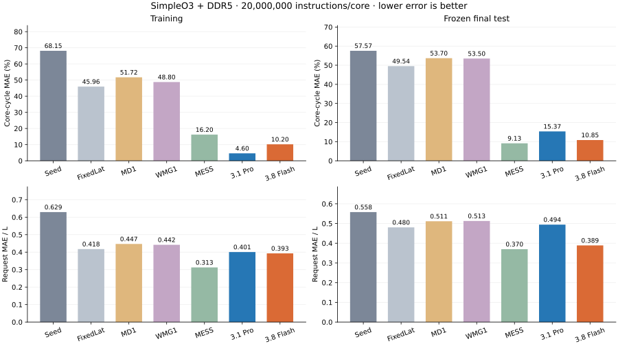
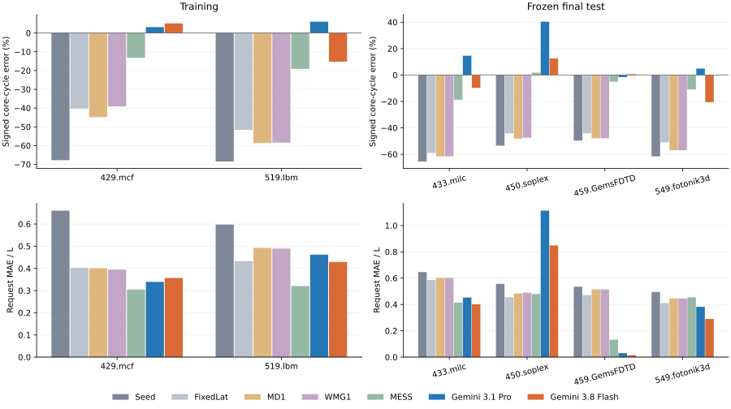
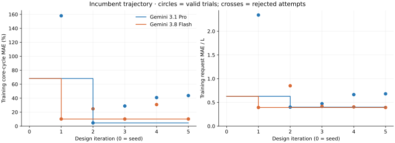

# Agent-evolved atomic DRAM simulation: project status

Updated 2026-09-05. This document is the concise review entry point for the
private hackathon repository. It contains no setup-conversation transcript.

## Research objective

Synthesize a fast, generic immediate-response DRAM controller through an
agent/evaluation feedback loop. At admission, the model commits an immutable
request completion time using the current request, resolved configuration, and
bounded causal state. It must not reproduce the cycle-level command scheduler,
inspect future requests, or specialize to workload identities. Every proposed
approximation must have a technical explanation.

An earlier independent feasibility study, developed with Fable 5, GPT-5.6, and
human interventions, obtained promising atomic-controller results. This work
attempts to formalize that approach in the existing CHIA evolution framework.
That implementation, its rules, and its results are not available to the CHIA
optimization agents. Consequently, failure of a particular backend or trial
does not by itself disprove the broader approach.

The initial scope is SimpleO3 + DDR5. Evaluation/instrumentation infrastructure
for LPDDR5/LPDDR6, HBM4, ChampSim, and gem5 is retained, but cross-frontend and
cross-standard transfer studies are deferred. Documentation and reproducible
scientific evidence take priority over competition placement.

## Evaluation and metrics

The reference is Ramulator GenericDDR with FRFCFS-RowHit scheduling, open rows,
no refresh, DDR5_16Gb_x8 / DDR5_4800AN, and one channel/rank. Read/write buffers each
hold 64 requests; write-drain low/high watermarks are 0.5/0.8. These settings
are supplied as configuration rather than embedded in candidate models.

Training families are mcf and lbm. Final testing uses milc, soplex, GemsFDTD,
and fotonik3d, after both backend selections are frozen. Each run issues
20 million instructions/core from cold initialization and drains outstanding
work completely. There is no separate unscored warmup. Inputs must not wrap;
hashes and family identities are checked across the split. The meta-reviewers
have seen these test families in earlier work; fresh optimization agents have
not. These results are not a pristine unseen benchmark for adaptive campaigns.

Two objectives have equal standing; lower is better:

1. **Core-cycle MAE (%)**: for each core, take
   `abs(100 * (model_cycles - oracle_cycles) / oracle_cycles)`. Average across
   cores in a workload, then equally across workloads.
2. **Request MAE / L**: pair logical reads by stable
   `(source, frontend_id, frontend_sub_id)` and verify address/type identity and
   exact bidirectional coverage. For each pair,
   `d = model_latency - oracle_latency`, where latency is departure minus
   arrival in frontend cycles. For each workload, `L` is the mean latency of
   **all oracle logical reads**, including LLC hits, merged misses, and DRAM
   miss owners. The workload score is `mean(abs(d))/L`; average workloads
   equally for the headline.

Diagnostics retain `abs(mean(d))/L` (absolute signed drift),
`percentile99(abs(d))/L` (paired P99 error), signed minima/maxima, distribution
errors, final frontend/controller statistics, and instrumented simulation wall
time. The headline P99 is the worst workload P99; it is not a pooled latency
percentile. Positive signed error means predicted latency is too large.

Closed-loop scores control evolution. Logical traces measure the frontend LLC
boundary; separate controller traces use DRAM cycles and explain memory-system
behavior. They must not be mixed without clock conversion. Synthetic and
open-loop tools are retained for diagnosis, but are not promotion evidence
and are not yet wired into the real Gemini tool adapter.

The four immediate-response comparators are FixedLat (fixed delay and a
bandwidth pipe), zsim-style whole-memory M/D/1, Sniper's channel-level windowed
M/G/1, and MESS-style bandwidth/latency curves. The MESS DDR5 surface is
oracle-calibrated and checksum-bound; it has a different calibration advantage
from an untrained seed. The under-review bank-level queueing model is absent.

## Current implementation

CHIA dispatches proposal, optimized build, and evaluation nodes using Ray.
Candidate and reference simulations share a pinned interleave. Preflight
compares normal and isolated execution for identical traces, core cycles, and
integer statistics; it also tests actual loaded-candidate file/network denial.

The repository's Atomic controller remains a fixed-delay seed. Agents may edit
bounded model state, helpers, parameter defaults/ranges, initialization, and
admission-time prediction. The trusted wrapper owns configuration plumbing,
mapping, capacities, clocks, callbacks, tracing, and statistics. A scoped
`model_param` interface supports new approximation parameters, while resolved
DRAM/controller behavior remains read-only.

Candidates submit complete editable-region bodies. The runner assembles them
without changing the protected wrapper, builds with `-O3`, and obtains a
source-specific compliance review from the orchestrating coding agent. This
review enforces the scientific contract without supplying modeling repairs or
tuning hints. Only the proposing backend repairs a rejected draft. Native C++
isolation and lexical checks are defenses, not a memory-safety proof.

A valid challenger replaces the incumbent only if neither objective worsens
and at least one improves. Non-dominated tradeoffs may remain in a Pareto
archive without promotion. There is no weighted objective, invented accuracy
threshold, or test-based selection. Human intervention is recorded and allowed
in principle; initial backend trials receive no human modeling insights.

## Completed Gemini comparison

The [Gemini 3.1 Pro Preview run](results/gemini_20260905/runs/gemini_repair_v4c_20260905__gemini-3.1-pro-preview/summary.json)
and [Gemini 3.8 Flash run](results/gemini_20260905/runs/gemini_repair_v4c_20260905__gemini-3.8-flash/summary.json)
are independent optimization runs, each starting from the same clean seed.
`gemini_repair_v4c_20260905` names their historical shared execution directory,
not a joint model run. Each has its own model identity, budget, interactions,
candidate lineage, selection, and results; the comparison references the two
run records without merging them. Both completed
five evaluated designs, with one promotion each. The execution protocol and
runtime were frozen before generation; subsequent storage/reporting changes
did not alter the evaluated sources or scores.

Protocol v4 uses HIGH thinking, a 65,536-token output ceiling, and USD 50 per
run. Each iteration allows draft repair, up to 48 model turns, 192 inspection
requests, and 12 drafts. Input is token-counted before dispatch. The last two
turns are reserved for submission/repair. These are runaway guards, not
accuracy thresholds; neither run stopped because of spending or truncation.

The matched 20M-instruction results are:

| Model | Training core MAE (%) | Training request MAE/L | Test core MAE (%) | Test request MAE/L |
| --- | ---: | ---: | ---: | ---: |
| Fixed-delay seed | 68.15 | 0.6291 | 57.57 | 0.5580 |
| FixedLat | 45.96 | 0.4176 | 49.54 | 0.4804 |
| MD1 | 51.72 | 0.4468 | 53.70 | 0.5115 |
| Sniper WMG1 | 48.80 | 0.4420 | 53.50 | 0.5130 |
| MESS | 16.20 | 0.3126 | 9.13 | 0.3700 |
| Gemini 3.1 Pro (`pro_002`) | 4.60 | 0.4006 | 15.37 | 0.4945 |
| Gemini 3.8 Flash (`flash_001`) | 10.20 | 0.3928 | 10.85 | 0.3889 |

Pro has lower training core-cycle error, but Flash is better on both held-out
headline objectives. Flash improves both held-out averages over the seed,
FixedLat, MD1, and WMG1; MESS remains better on both headline averages. Pro's
held-out request error is slightly worse than FixedLat despite much better
core-cycle accuracy. This is one independent run per backend, not a
general model-capability ranking or five independent repetitions.

| Backend | Evaluated designs | Submitted drafts | Generation attempts | Full-input-rate estimate, USD |
| --- | ---: | ---: | ---: | ---: |
| Gemini 3.1 Pro Preview | 5 | 12 | 22 | 4.93 |
| Gemini 3.8 Flash | 5 | 7 | 126 | 8.15 |

Attempt counts cover each model's completed run. Cost estimates include thinking
and financial carryover from aborted infrastructure setup: USD 0.4840 for Pro
(3 earlier attempts) and USD 0.0149 for Flash (2 earlier attempts). Carryover
imported no model source or feedback and did not replenish the USD 50 caps.
The table conservatively charges cached input at full input rates. For current
run calls alone, cache-adjusted usage estimates are USD 4.12 and USD 2.92,
respectively. None of these estimates is a Cloud Billing invoice or includes
credit effects. Conservative cap accounting was USD 9.81 / 19.56; no usage is
unresolved.

All 22 Pro responses ended normally. Flash returned 119 normal responses and
7 malformed-function-call responses, recovered within the same repair loop.
Neither backend returned a token-limit termination. Peak output usage,
including thinking, was 36,671 tokens for Pro and 54,500 for Flash.

## Selected models and remaining errors

The [Pro source](results/gemini_20260905/runs/gemini_repair_v4c_20260905__gemini-3.1-pro-preview/selected.cpp) maintains per-bank
row state and fluid backlogs for banks and the shared data bus. Backlogs decay
with elapsed causal time; the predicted latency combines row-dependent base
latency with the larger bank/bus wait. Configured write watermarks trigger
aggregate write-bus service. State is O(B), with O(1) prediction work, where B
is the configured bank count represented by the model.
Its current bank indexing does not distinguish ranks; multi-rank behavior is
not validated by this single-rank experiment.

The [Flash source](results/gemini_20260905/runs/gemini_repair_v4c_20260905__gemini-3.8-flash/selected.cpp) combines bank
row/readiness state, a bounded calendar of immutable read-burst departures,
and aggregate write-drain accounting. Read bursts can occupy earlier free
bus slots without changing previous predictions. State is O(B+C), and read
prediction takes O(C) worst-case calendar work, where C is read admission
capacity. Neither selected model dispatches an explicit DRAM command sequence.
Both retain the trusted callback heap and its bookkeeping cost. The snapshots
preserve exact evaluated bytes; surrounding scaffold comments describe the seed.

These are explainable approximations, not exact reproductions of FRFCFS.
No rule ablation or transfer study establishes which mechanism contributes
most, and no controlled speed measurement supports an absolute speed claim.

Soplex is the dominant paired-request failure case: request MAE/L is 1.1129
for Pro and 0.8490 for Flash, with positive core-cycle errors of 40.40% and
12.53%. Maximum positive paired errors reach 4,567 and 3,624 frontend cycles.
Conversely, GemsFDTD is modeled closely: request MAE/L is 0.0304 and 0.0148.
Flash is not uniformly better per workload; its fotonik3d core-cycle error is
20.51%, versus 4.90% for Pro.

Held-out drift and tail diagnostics remain important:

| Model | Absolute signed drift/L | Worst paired P99/L | Most negative / positive d/L |
| --- | ---: | ---: | ---: |
| Pro | 0.2645 | 16.5228 | -10.058 / +20.209 |
| Flash | 0.2004 | 12.8059 | -10.775 / +16.036 |
| MESS | 0.0993 | 5.8764 | -10.408 / +1.319 |

Later designs did not dominate the selected incumbents. Some improved tail
error while worsening core-cycle accuracy. One Flash tradeoff remained in
the Pareto archive, but was not promoted. Flash's fifth design produced
byte-identical logical and controller traces to its incumbent on both training
workloads: its proposed change had no observed effect in those runs.
The models' causal explanations are hypotheses, not conclusions established
merely by generating plausible code.

Earlier attempts used Flash 3.5 and a more restrictive submission protocol.
A short-window Pro improvement did not survive full-window reassessment and
is excluded as success evidence. A subsequent 20M/64K-output experiment had
no valid evaluated generated model. The current result demonstrates that the
repairable workflow can produce useful models, but simultaneous backend and
protocol changes prevent attributing the difference to Flash 3.8 alone.

## Reproduction, artifacts, and next steps

See the [runner guide](../tools/chia_loop/README.md) for setup, execution, review,
and analysis commands, and the [evaluation guide](../tools/eval/README.md) for
measurement contracts. Execution snapshots, prompts, source lineage, all model
interactions, rejection reasons, budgets, and compressed raw traces are
retained locally for audit. Compression verifies byte count and SHA-256 before
removing the raw copy; readers support gzip without bulk decompression.
The final integrity audit passed across 70 simulator executions and 140 trace archives
in the shared historical store, not 70 independent optimization runs,
including exact scored request pairing, 37 candidate callback checks,
frozen-source/runtime identities, and test execution after both freezes.
Trace storage is 2.47 GB instead of 7.79 GB raw, a 68.26% reduction.
Execution preflight passed 43 targeted tests. Subsequent regression coverage
also checks storage/export integrity and independent run recording; it does
not rerun model evolution or alter the recorded measurements.

One non-scored preflight gzip had a single-bit mismatch detected at final
verification. It was restored from an intact duplicate matching both original
compressed and raw checksums; the damaged copy and recovery record are retained.
No scored archive, expected checksum, selected source, or score was changed.
The underlying cause of the corruption was not established. Post-run storage
and reporting changes are recorded separately from the frozen experiment.

The [comparison index](results/gemini_20260905/summary.json) references the two
individual run summaries. Each run summary retains its own source identity,
accounting, training/test metrics, trajectory, and per-workload table. The
[headline table](results/gemini_20260905/headline.csv) and
[per-workload comparison table](results/gemini_20260905/per_workload.csv) place
the independently measured results side by side, including primary errors,
drift, tails, and signed extremes. They do not pool model budgets or lineage.
The generated controller snapshots are review artifacts, not active build targets;
the main Atomic source remains the clean seed.

New executions use the individual-run v5 recording protocol: one explicit
`--model` and one unique run root per invocation, followed by a separate
comparison command. Each selection is frozen before that run's held-out test.
The original v4 execution waited for both freezes; its evidence remains
unchanged. The recording refactor made no new generation calls or simulator
evaluations and did not duplicate the large shared trace archives.

This review repository excludes raw interaction transcripts, detailed pipeline
setup discussions, unrelated DRAM-timing review notes, credentials, and
licensed traces. Compact results do not replace the retained full audit data.

Next steps are repeated independent trials, training-side rule ablations,
controlled speed measurements, and broader diagnostic tools. If observed
Soplex failures inform later optimization, that workload must become development
data and a new untouched test set is needed. Additional backends should start
clean if used; frontend/standard transfer remains deferred.

Provider configuration is checked against Google's
[Gemini 3.8 Flash specification](https://docs.cloud.google.com/gemini-enterprise-agent-platform/models/gemini/3-8-flash),
[Gemini 3.1 Pro specification](https://docs.cloud.google.com/gemini-enterprise-agent-platform/models/gemini/3-1-pro),
and [pricing](https://cloud.google.com/gemini-enterprise-agent-platform/generative-ai/pricing).
HIGH is a relative dynamic effort setting, not equal reasoning-token use.

## Extended search trials

The next experiment runs Gemini 3.1 Pro Preview and Gemini 3.8 Flash
independently from the clean seed, each for at most 25 evaluated designs and
USD 100 of conservative budget accounting. Each run receives six CPU slots;
combined evaluation parallelism is at most 12. The full 20M-instruction ROI,
HIGH thinking, 65,536 output-token ceiling, comparison models, training split,
atomicity checks, and Pareto promotion rule are unchanged. The v6 runner pins
these configurable limits per run; a new invocation cannot alter an existing
budget or silently resume a paid run.

Earlier designs, results, and test feedback are not supplied to either agent.
Training trajectories will show whether iterations beyond five improve the
incumbent. Final testing occurs only after each run freezes its selection.
These are fresh stochastic trials, not continuations of test-exposed models;
one trial per backend cannot establish a general model-capability ranking.
No extended-trial results are claimed until execution and audit complete.
